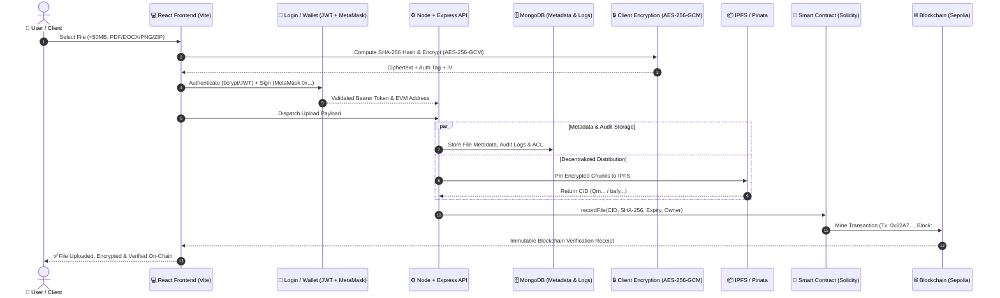

# 🔐 BlockShare &bull; Secure File Sharing with Blockchain

A decentralized, cryptographically secure file sharing platform built with **React (Vite)**, **Node.js/Express**, **MongoDB**, **Web3 (Ethers.js / MetaMask)**, **IPFS (Pinata)**, and **Solidity Smart Contracts**.

---

## 🏗️ Complete System Flow Architecture

```text
                 USER
                  │
                  ▼
           ┌──────────────┐
           │ React Frontend│
           └──────┬───────┘
                  │
          Login / Wallet
                  │
                  ▼
           ┌──────────────┐
           │ Node + Express│
           └──────┬───────┘
                  │
          ┌───────┴────────┐
          │                │
          ▼                ▼
     ┌─────────┐      ┌──────────┐
     │ MongoDB │      │Encryption│
     └─────────┘      └────┬─────┘
                           │
                           ▼
                        ┌─────┐
                        │IPFS │
                        └──┬──┘
                           │
                          CID
                           │
                           ▼
                   ┌──────────────┐
                   │ Smart Contract│
                   └──────┬───────┘
                          │
                          ▼
                      Blockchain
```

### 🔁 Sequence of Operations (Data Pipeline)



---

## 🧩 Architectural Tiers Explained

| Tier | Component | Technology | Responsibility |
|---|---|---|---|
| **1** | **USER** | Document Owner / Recipient | Initiates file upload, defines permissions, inspects verification state. |
| **2** | **React Frontend** | React 18, Vite, CSS Tokens | Modern glassmorphic UI, responsive simulation (Desktop/Tablet/Mobile), Web Crypto. |
| **3** | **Login / Wallet** | JWT, bcrypt, Ethers.js, MetaMask | Dual authentication: Password security (12 rounds) + Web3 EVM wallet signature. |
| **4** | **Node + Express** | Express.js, Helmet, Rate Limiter | API Gateway, strict input validation firewall, TLS 1.3 HTTPS with HSTS. |
| **5A** | **MongoDB** | Mongoose, BSON Engine | File metadata, user accounts, audit telemetry logs. *(Zero plaintext keys stored)*. |
| **5B** | **Encryption** | Web Crypto AES-256-GCM, ECDH | Client-side envelope encryption with PBKDF2 salt, 96-bit IV, and crypto-shredding. |
| **6** | **IPFS** | Pinata Cloud / IPFS P2P | Decentralized Merkle DAG storage cluster; only encrypted ciphertext chunks pinned. |
| **7** | **CID** | Multihash (v0/v1) | Deterministic content hash address (`Qm...` / `bafy...`). Byte tampering changes CID. |
| **8** | **Smart Contract** | Solidity 0.8.20, OpenZeppelin | `FileShareRegistry.sol` enforces immutable access control, time expiration, revocation. |
| **9** | **Blockchain** | Ethereum Sepolia / Polygon | Immutable ledger recording transaction hashes (`0x82A7...`) and block receipts. |

---

## 🌟 Key Features Implemented

1. **User Authentication & Password Security**:
   - bcrypt 12 salt rounds with Argon2/bcrypt standards.
   - JWT tokens with 24-hour expiration and Bearer authorization.
2. **Web3 MetaMask Wallet Linking**:
   - Connects to Ethereum / Sepolia / Polygon networks via MetaMask (`window.ethereum`).
   - Cryptographic ownership verification via ECDSA signatures.
3. **Zero-Knowledge Client-Side Encryption**:
   - AES-GCM (256-bit key) with random 96-bit IV and PBKDF2 key derivation.
   - Secret keys are wrapped using recipient public keys via ECDH envelopes.
4. **IPFS Decentralized Storage**:
   - Uploads only encrypted ciphertext to IPFS cluster nodes with Pinata pinning.
5. **Solidity Smart Contract (`FileShareRegistry.sol`)**:
   - On-chain file registration, time-based expiration timestamps, dynamic whitelist management.
6. **6-Stage Multi-Barrier Gatekeeper Pipeline**:
   - Stage 1: Link Resolution & Token Validity
   - Stage 2: Expiration Time Check
   - Stage 3: Revocation & Crypto-Shredding Verification
   - Stage 4: Access Mode (Public vs Private)
   - Stage 5: Recipient Wallet Whitelist Verification
   - Stage 6: Key Unwrapping & Decryption
7. **Crypto-Shredding & Deletion Distinctions**:
   - Distinguishes **Application Access Removal** from **Physical IPFS Unpinning** and **Crypto-Shredding** (destroying decryption keys to make pinned data permanently undecryptable).
8. **Security Firewall & File Restrictions**:
   - Strict 50 MB file size limit and MIME-type white-listing (PDF, DOCX, PPTX, PNG, JPG, ZIP, TXT).
9. **Rich File Metadata Inspection**:
   - File Name, Size, MIME Type, Owner, IPFS CID, SHA-256 Hash, Upload Date, Expiry, Status.
10. **Enterprise Admin Panel**:
    - User directory, suspicious account suspension, real-time telemetry, system & storage stats.
11. **Analytics Dashboard**:
    - Weekly upload bar chart graphs and comprehensive activity metrics.
12. **Blockchain Transaction Details**:
    - Inspect transaction receipts (`0x82A7...`, Block `#893721`, Confirmed, Sepolia Etherscan link).
13. **🔎 Dedicated File Verification Page (`FILE VERIFICATION`)**:
    - Dedicated `/verify` route comparing on-chain **Blockchain Hash** with **Current File Hash**.
    - Instant indicators: `✅ FILE VERIFIED` or `❌ FILE MODIFIED`.
    - Live 1-click **Simulate Tamper (Change 1 Byte)** and local Web Crypto file tester.
14. **🏗️ Interactive System Flow Architecture**:
    - Dedicated visualizer modal demonstrating the end-to-end data flow with live step-by-step simulation.

---

## 🚀 Getting Started

### Prerequisites
- Node.js (v18+ recommended)
- MongoDB (Running locally on `mongodb://127.0.0.1:27017` or automatically uses built-in JSON store)
- MetaMask Browser Extension (Optional for Web3 interactions)

### 1. Installation
```bash
# Clone the repository
cd "project 1"

# Install root dependencies
npm install

# Install client dependencies
cd client
npm install
cd ..
```

### 2. Start Servers

#### Start Both Servers Concurrently:
```bash
npm run dev
```

#### Or Run Individually:
```bash
# Terminal 1 - Backend Server (HTTP :5000, HTTPS :5443)
npm run server

# Terminal 2 - Frontend Client (:5173)
npm run client
```

Open your browser at **`http://localhost:5173`**.

---

## 🧪 Running Automated Verification Tests

The test suite covers all security layers, encryption pipelines, transaction lookups, and verification endpoints:

```bash
# Verify File Integrity & Hash Matching (Section 29)
node scratch/test_file_verification.cjs

# Verify Blockchain Transaction Details (Section 28)
node scratch/test_transaction_details.cjs

# Verify Analytics & Upload Statistics (Section 27)
node scratch/test_analytics.cjs

# Verify Admin Panel & Suspensions (Section 26)
node scratch/test_admin_panel.cjs

# Verify Security Firewall, JWT & bcrypt (Section 21)
node scratch/test_security_features.cjs

# Verify Crypto-Shredding & Deletion Semantics (Section 20)
node scratch/test_deletion_crypto_shred.cjs
```

---

## 🔒 Security & Privacy Guarantee

- **Zero-Knowledge Architecture**: The backend server and database never receive raw plaintext files or plaintext decryption keys.
- **Tamper-Proof Integrity**: Any file modification in transit or on disk alters its SHA-256 digest and is immediately rejected by both the smart contract and the File Verification page.
- **Cryptographic Expiration**: Expired links cannot be decrypted even if an attacker intercepts the IPFS ciphertext, as smart contracts block key recovery after the expiration block/timestamp.
# project-1

